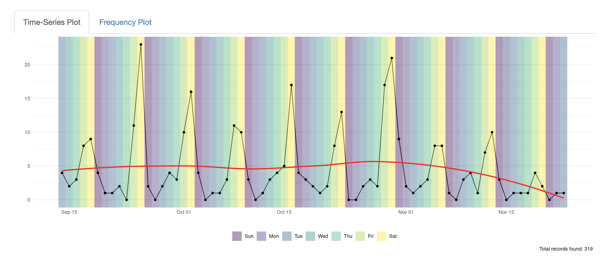

```{r setup, include=FALSE}
knitr::opts_chunk$set(echo = TRUE, messages = FALSE, warning = FALSE)
```


I have become increasingly interested in publicly available data and what insights such data can provide. 
For example, the San Luis Obispo Police Department in San Luis Obispo, California publishes records about each call they respond to. 
The department publishes their data a few times a week but provides no 
historical data. 

In order to be able to see any 
**interesting trends**
in such data we need to come up with a way to *easily* and
*automatically* collect the data.

```{r example, echo=FALSE, fig.cap="Figure from Github Repo: https://github.com/nagol/SLOPD_activity showing trend in Noise related calls"}

```


## Git-Scraping

Git-scraping is a fantastic solution for the automated scraping and storing
of data. [The term/concept was pioneered by Simon Willson in his article ](https://simonwillison.net/2020/Oct/9/git-scraping/). His article is fantastic; short, and easy to follow with plenty of examples.

The goal for this post was to try to write my own git-scraper from scratch. 
[The resulting code for the project is available on Github](https://github.com/nagol/SLOPD_data)

## Getting the Data

The San Luis Obispo Police Department publishes their data at the following link
[SLOPD Data](https://www.slocity.org/government/department-directory/police-department/police-log). According to the website, the data is updated by 3PM Monday - Thursday. The Monday data contains all of the weekend data as well.

Normally when we say 'scraping data' we mean using tools like R's `rvest` or
Python's `beautiful soup` or `scrapy` to extract data from the DOM of a webpage. 
In this case the data is actually posted as an embedded flat-file text document.

The 'scraper' in this case downloads the text file, breaks the file up into
'chunks' by exploiting the formatting of the data, iterates over the chunks
(each of which represents a SLOPD incident), and parses out the data. I tested
the scraper for a few days locally to make sure the data could be parsed correctly 
before trying to any automating. 

The Python code to parse this file is located [here](https://github.com/nagol/SLOPD_data/blob/main/scripts/slopd_scraper.py). 


## Automating with Github Actions

The script works great for manually gathering data but I need this thing to run
automatically. Further, we don't want to introduce any data duplication.

There are many ways to handle this situation: 

+ We could write a [cron job](https://en.wikipedia.org/wiki/Cron). What happens
though if your machine doesn't have internet access or is not on? We can't recover
the historical data, it would be lost forever.

+ We could setup an AWS EC2 instance and run our script there. Totally doable
but takes time to setup and may involve re-occurring charges.

**Enter [Github Actions](https://docs.github.com/en/actions).**

We can automate
our workflow by creating a *YAML* file that describes the
[workflow](https://github.com/nagol/SLOPD_data/blob/main/.github/workflows/main.yml).

The code chunk below contains a copy of this file. The basic pieces are:

+ Specifying when the scripts should run. Since I know when the department
updates their data, the scraper only run once a day Monday - Thursday.

+ Specifying the runtime environment. 
  + we specify to checkout the repo code
  + what type of machine to run the code on (Ubuntu)
  + how to configure the Python environment (version, packages to install)
  
+ Listing the tasks to complete.
  + run slopd_scraper.py
  + run analysis.py
  
+ Commit changes with a timestamp in the commit message.


```{bash eval = FALSE}

name: scraper-slopd

on:
  schedule:
    - cron: '26 23 * * MON,TUE,WED,THU'

jobs:
  build:
    runs-on: ubuntu-latest
    steps:

      - name: checkout repo content
        uses: actions/checkout@v2 # checkout the repository content to github runner

      - name: setup python
        uses: actions/setup-python@v2
        with:
          python-version: '3.7.7'
          
      - name: install python packages
        run: |
          python -m pip install --upgrade pip
          pip install -r requirements.txt
          
      - name: execute py script
        run: python scripts/slopd_scraper.py
        
      - name: execute py script2
        run: python scripts/analysis.py
          
      - name: commit files
        run: |
          git config --local user.email "action@github.com"
          git config --local user.name "GitHub Action"
          git add -A
          timestamp=$(date -u)
          git commit -m "update with latest data, create new plots: ${timestamp}" || exit 0
          
      - name: push changes
        uses: ad-m/github-push-action@v0.6.0
        with:
          github_token: ${{ secrets.GITHUB_TOKEN }}
          branch: main

```


