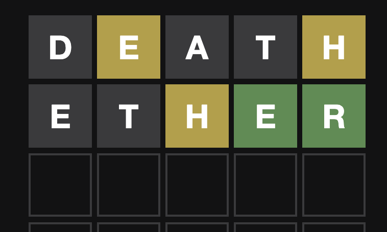
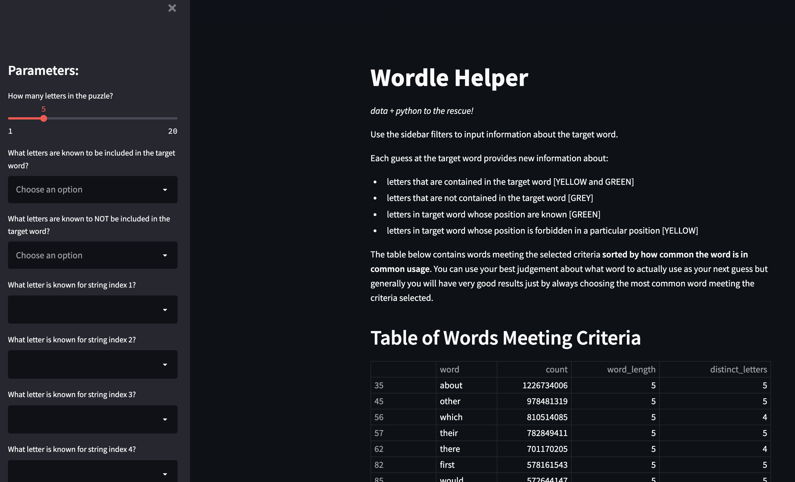

```{r setup, include=FALSE}
knitr::opts_chunk$set(echo = TRUE, message = FALSE, warning = FALSE)
```

[Wordle](https://en.wikipedia.org/wiki/Wordle) is a popular word-based game where
the ultimate goal is to guess a specific word. Typically, the game is played with
5 letter words but variations exist.

You are required to make guesses of the target word using valid English words of
the appropriate length, usually 5 letters in length. 

For each guess you are provided with the following information:

+ the letter turns green if the target word has that specific letter in that particular
location in the word

+ the letter turns yellow if the target word contains that specific letter but in
the target word, the letter appears in a different position

+ the letter turns grey if the target word does not contain that specific letter

```{r example, echo=FALSE, fig.cap="Screenshot from an New York Times Daily Wordle Game"}

```


In the screenshot, we can see that the first guess was 'DEATH' and since the 
*E* and the *H* are both YELLOW then we know the target word contains *E* and *H*
but the *E* is not in the second position and the *H* is not in the fifth position.
Further since the *D*, *A*, and *T* are grey, we know the target word does not 
contain any of them.

The next guess was 'ETHER' and we now see that there are green *E* and *R* meaning
that those letters are in the correct position. The *H* is yellow so we know that the
*H* in the target word is not in the third location. The grey *T* shouldn't suprise us, we already know from the first guess that no *T* existed in the target word and its
presence in the second guess constitutes a *waste* of a guess. The second grey *E* signifies that the target word doesn't have a second *E* in it other than the one
that lives in the fourth location.

From this example, we can determine that there are four pieces of information 
to keep track of:

1. Letters we know are contained in the target word. We could store such values
in a list. Example: `contains_list = ['E', 'H', 'R']`

1. Letters we know are not contained in the target word. We could store such values
in a list. Example: `does_not_contain_list = ['D', 'A', 'T']`

1. Letters we know can't be in specific positions in the target word. For a specific position, there may be many known non-valid letters. We could store such values
in a dictionary using the positions as keys and a list of non-valid letters as
values. `position_not_known_dict = {2: ['E'], 3:['H'], 5:['H']}`

1. Letters we know to be in specific positions in the target word. For a specific position, there is only one possible valid letter. We could store such values
in a dictionary using the positions as keys and a single valid letter as a
value. Example: `position_known_dict = {4: 'E', 5:'R'}`

For each word guessed, we can update these 4 data structures to capture all
of the information about what is allowed for the target word.

## Build a Wordle Helper Function


### Data

The first thing we need to generate are guesses. Each guess needs to be a valid English word of the right length.

The [Kaggle Data](https://www.kaggle.com/datasets/rtatman/english-word-frequency)
contains "the counts of the 333,333 most commonly-used single words on the English language web, as derived from the Google Web Trillion Word Corpus." One nice feature
of these data is that there is a *count* column which we can use as a proxy for 
*word popularity*. Generally, the target word is most likely to be relatively
close to the top of a table, sorted in decending order by *count*, containing
the valid list of words currently meeting the known criteria. 

To make these data a little more helpful for a Wordle Helper app, we can add a 
few helpful fields: 

+ number of letters per word to easily grab words of the right length

+ number of distinct letters per word to perhaps choose words with more distinct 
letters to maximize the information we receive from our guess

This processing only needs to happen once. The code chuck below shows the contents
of [ETL_dictionary.py](https://github.com/nagol/wordle_helper/blob/master/ETL_dictionary.py). 

```{python, eval = FALSE}
import pandas as pd

# Load data with word, word freq over trillion word coupus
word_dictionary = pd.read_csv("./data/unigram_freq.csv")

# remove null words
word_dictionary = word_dictionary[word_dictionary.word.notnull()]

# create column with word lengths
word_dictionary['word_length'] = word_dictionary.word.str.len().astype(int)
word_dictionary['distinct_letters'] = word_dictionary.word.apply(lambda x: len(set(x)))

# export transformed data
word_dictionary.to_csv("./data/transformed_dictionary.csv", index = False)
```

### Program Logic

With the right data available, we need to create a function that help to filter
the the words to the most likely valid words.

The function below takes in all of the necessary inputs and eliminates words
from the passed `english_dictionary` (the data we prepared previously)
that are found to be impossible given the information we have discovered. 


```{python eval = FALSE}

def get_possible_words(
    english_dictionary,
    word_length = 5, 
    contains_list = [], 
    does_not_contain_list = [], 
    position_known_dict = {}, 
    position_not_known_dict = {}):
    
    '''
        english_dictionary - dictionary containing word and word metadata
        word_length - integer indicating the word length for the puzzle (commonly 5 or 6)
        contains_list - list of letters known to be in the target word (YELLOW or GREEN)
            ex. ['a', 't']
        does_not_contain_list - list of letters known to not be in target word (GREY)
            ex. ['h']
        position_known_dict - dictionary with letter postions as keys (GREEN)
            ex. {1:'a', '5:'t'}
        position_not_known_dict - dictionary with letter position as keys and values
            in a list since there may be many known non-letters for a given position
            ex. {1:['b', 'c'], 4: ['t]}
    '''
    
    # subset to desired length
    english_dictionary = english_dictionary[(english_dictionary.word_length == word_length)]

    # remove impossible words
    if contains_list:

        for letter in contains_list:
            english_dictionary = english_dictionary[
                (english_dictionary.word.str.contains(letter, regex = True))
                ]

    if does_not_contain_list:

        for letter in does_not_contain_list:
            english_dictionary = english_dictionary[
                (~english_dictionary.word.str.contains(letter, regex = True))
                ]

    if position_known_dict:

        for key, value in position_known_dict.items():
             english_dictionary = english_dictionary[
                (english_dictionary.word.str.slice(start = key-1, stop = key, step = 1) == value)
                ]

    if position_not_known_dict:

        for key, value in position_not_known_dict.items():
            for letter in value:
                english_dictionary = english_dictionary[
                    (english_dictionary.word.str.slice(start = key-1, stop = key, step = 1) != letter)
                    ]

    print(f"There are currently {len(english_dictionary.index)} possible words")
    print(f"Here are the top 50 based on the information provided:")
    print(english_dictionary.head(50))

    return english_dictionary

```

One downside to this function is that it requires us to rerun the function with
each guess and type in all the information. Maybe we can make the function
interactive by wrapping the functionality up into a dashboard?

### Buidling a Simple Streamlit App

[Streamlit](https://docs.streamlit.io/) is a very simple framework for quickly making
data based web applications. The main thing to decide are what we want to control.

The main function `get_possible_words()` contains the following arguments that 
should be turned into interactive inputs in the app. The list of available widgets
are [here](https://docs.streamlit.io/library/get-started/main-concepts). 

+ word_length - a slider would work great for this. We only set this parameter
once at the beginning of the game and leave it. Just for fun, let's allow words
as short as 1 and as long as 20.

+ contains_list - a *multiselect* works great for this. We will have a list of possible values (letters of the alphabet) for the user to select from and the selected
values will populate the list

+ does_not_contain_list = a *multiselect* works great for this. We will have a list of possible values (letters of the alphabet) for the user to select from and the selected
values will populate the list

+ position_known_dict - a *selectbox* for each *letter position* would work, then we
will be able to select only one value for each *letter position*. We need to dynamically add as a function of `word_length`.

+ position_not_known_dict - a *multiselect* works great for this but we will need one
for each *letter position*. We need to dynamically add as a function of `word_length`.

Once the input controls are determined, we need to determine what output to create.
For this app this is easy...we want to display the data meeting the requirements 
determined by the inputs. The data will be the main display of the app, along with
some commentary and useful links.

The [code for the Streamlit App](https://github.com/nagol/wordle_helper/blob/master/wordle_app.py) is available
below:

```{python eval = FALSE}

import streamlit as st
import pandas as pd
from get_possible_words import *

st.set_page_config(
    page_title="Wordle Helper", 
    page_icon="📊", 
    initial_sidebar_state="expanded"
)

# Load data with word, word freq over trillion word coupus
word_dictionary = pd.read_csv("./data/transformed_dictionary.csv")

# Set helper variables
alphabet = ['', 'a','b','c','d','e','f','g','h','i','j','k','l','m','n','o','p','q','r','s','t','u','v','w','x','y','z']
VERBOSE = False

st.write(
    """
# Wordle Helper
*data + python to the rescue!*
Use the sidebar filters to input information about the target word.
Each guess at the target word provides new information about:
+ letters that are contained in the target word [YELLOW and GREEN]
+ letters that are not contained in the target word [GREY]
+ letters in target word whose position are known [GREEN]
+ letters in target word whose position is forbidden in a particular position [YELLOW]
The table below contains words meeting the selected criteria **sorted by how common the word is in common usage**.
You can use your best judgement about what word to actually use as your next guess but generally you will have
very good results just by always choosing the most common word meeting the criteria selected.
## Table of Words Meeting Criteria
"""
)

st.sidebar.write(
    """
    # Parameters:
"""
)

number = st.sidebar.slider(
    'How many letters in the puzzle?',
    min_value = 1,
    max_value = 20,
    value = 5,
    step = 1)

# get letters known to be in the target word
known_letters = st.sidebar.multiselect(
     'What letters are known to be included in the target word?',
     alphabet,
     [])

# get letters known to not be in the target word
known_nonletters = st.sidebar.multiselect(
     'What letters are known to NOT be included in the target word?',
     alphabet,
     [])

# get known position information
known_positions = {index:'' for index in range(1, number + 1)}
for pos in known_positions:
    known_positions[pos] = st.sidebar.selectbox(
        f"What letter is known for string index {pos}?",
        alphabet,
        key = 'known' + str(pos))

# get known non-position information
known_nonpositions = {index:[] for index in range(1, number + 1)}
for pos in known_nonpositions:
    
    known_nonpositions[pos] = st.sidebar.multiselect(
        f"What letter(s) are forbidden for string index {pos}?",
        alphabet,
        key = 'unknown' + str(pos))


# convert the input data structures into form originally intended for get_possible_words()
known_position_dict = {}
for index in range(1, number + 1):
    if known_positions[index] != '':
        known_position_dict[index] = known_positions[index]

known_nonpositions_dict = {}
for index in range(1, number + 1):
    if known_nonpositions[index] != []:
        known_nonpositions_dict[index] = known_nonpositions[index]


dictionary_data = get_possible_words(
    word_dictionary,
    word_length = number,
    contains_list = known_letters,
    does_not_contain_list = known_nonletters,
    position_known_dict = known_position_dict, 
    position_not_known_dict = known_nonpositions_dict
    )
st.write(dictionary_data, height = 500)

st.markdown("The data used is from [Kaggle](https://www.kaggle.com/datasets/rtatman/english-word-frequency).")
st.markdown("The code to build this app are located [github](https://github.com/nagol/wordle_helper).")
# For debugging
#"st.session_state object", st.session_state

if VERBOSE:
    st.write('Puzzle word size: ', number)
    st.write('Current known letters are:', ', '.join(known_letters))
    st.write('Current known non-letters are:', ', '.join(known_nonletters))
    
    for pos in range(1, number + 1):
        st.write(f"The letter in position {pos} is known to be:", known_positions[pos])
        st.write(f"The letter in position {pos} is forbidden to be:", ', '.join(known_nonpositions[pos]))

```

### Publishing the App

The app can be easily deployed for free using the [Streamlit Cloud](https://streamlit.io/cloud).

After making an account you can deploy the app directly from Github.

[Link to Final Streamlit App](https://share.streamlit.io/nagol/wordle_helper/wordle_app.py)


```{r app, echo=FALSE, fig.cap="Screenshot from Final Wordle Helper App"}

```

